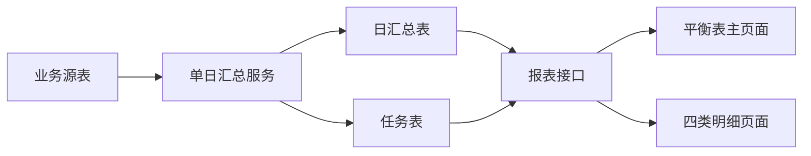

# 会员充值消费平衡表功能说明

> [!info] 文档定位
> 本文只描述“会员充值消费平衡表”当前代码已经实现的行为，包括数据来源、汇总口径、余额还原、任务机制、接口、页面交互、明细字段和实现边界。技术设计及历史决策参见[[平衡表方案]]。

> [!important] 事实依据
> 文档以 2026-08-03 工作区代码为准。凡是代码未实现或无法从代码确认的内容，均不作为已实现功能描述；“后端返回”和“前端展示”分别说明，避免把接口能力误写成页面能力。

## 一、实现范围与代码依据

### 1.1 用户指定的核心文件

后端：

- `bjos.maninterface.recon/BJOS.ManInterface/BLL/ETL/MemberFinanceDaySummaryService.cs`
- `bjos.maninterface.recon/BJOS.ManInterface/BLL/ComRpt/ComMemberFinanceDayBLL.cs`
- `bjos.maninterface.recon/BJOS.ManInterface/BLL/ComRpt/MemberFinanceBalanceCalculator.cs`
- `bjos.maninterface.recon/BJOS.ManInterface/Controllers/ComRpt/ComRptListController.cs`
- `bjos.maninterface.recon/BJOS.ManInterface/Controllers/ETL/ETLController.cs`
- `bjos.maninterface.recon/BJOS.ManInterface/Models/r_member_finance_day.cs`
- `bjos.maninterface.recon/BJOS.ManInterface/Models/r_member_finance_day_task.cs`

前端：

- `html/page/comReportQuery/memberFinanceDay.html`
- `html/js/comReportQuery/memberFinanceDay.js`
- `html/page/comReportQuery/memberFinanceDayDetail.html`
- `html/js/comReportQuery/memberFinanceDayDetail.js`

### 1.2 为解释直接调用关系而核对的关联文件

- `Models/input/MemberFinanceDayInput.cs`：报表请求参数。
- `Models/job/MemberFinanceDayJobInput.cs`：任务业务日期参数。
- `Models/BaseInput.cs`：`scdate`、分页和登录令牌等通用参数。
- `BLL/ETL/ETLBAL .cs`：定时任务对汇总服务的实际调用和异常返回。
- `Models/CommonModels.cs`：两个报表表的 EF `DbSet` 注册。
- `database/r_member_finance_day.sql`：字段约束、唯一维度及索引。
- `database/r_member_finance_day_verify.sql`：现有只读核验口径。

## 二、功能全景

会员充值消费平衡表是一套旁路日汇总与查询功能。汇总任务读取充值、消费、账户、会员、站点、优惠券和消费宽表数据，写入报表专用日汇总表与任务表；查询页面不直接对全部业务流水做公司级统计，而是读取已经生成的日汇总结果。订单明细仍直接查询业务源表。



当前已实现的主要能力：

1. 按当前登录公司查询经营指标和三类会员账户余额勾稽。
2. 按公司、会员类别、站点三级保存日汇总。
3. 在页面按会员类别和站点树逐层查看流水汇总。
4. 从汇总行钻取普通充值、退款、余额消费扣款和加油订单明细。
5. 记录汇总任务状态、执行阶段、异常和数据质量诊断。
6. 支持签名任务默认生成 T-1，也支持页面对一个历史业务日手动重算。
7. 通过数据库锁、可重复读事务和整日替换避免并发重算及半成品结果。

> [!note] 旁路边界
> 汇总过程不更新 `s_rechargeorder`、`s_consorder`、`s_account`、`r_consorderlist`、`s_couponuser` 等业务表。代码只写 `r_member_finance_day` 和 `r_member_finance_day_task`。

## 三、鉴权、公司隔离与菜单权限

### 3.1 页面报表接口

全部 `/com/rpt/ComMemberFinanceDay*` 接口统一经过 `RunMemberFinanceQuery`：

1. 使用请求中的 `token` 调用 `OnAuthorization`，要求 `typeid = "1"`。
2. 登录校验失败时，直接返回原鉴权错误码和错误消息。
3. 非超级管理员必须在 `s_rolesmenu` 中存在 `rolesid = 当前角色` 且 `menuid = 803027` 的记录。
4. 超级管理员角色 ID `000000000000000000000000000000000000` 跳过菜单记录检查。
5. 未授权返回错误码 `-30`，消息为“暂无此权限，请联系管理员！”。
6. 鉴权成功后，后端用鉴权结果覆盖 `Base_companyid`、角色、站点、用户等基础字段；调用方不能通过请求体自行指定其他公司。

因此，公司级汇总、树、任务、手动重算和全部明细都限制在当前登录公司。

### 3.2 任务接口

`POST /job/ComJobMemberFinanceDay` 使用 `JobOnAuthorization` 验证签名。验证失败返回 `401` 和“验证出错”。任务使用任务输入中的 `companyid`，不是页面登录公司。

### 3.3 菜单

| 项目 | 值 |
| --- | --- |
| 菜单名称 | 会员充值消费平衡表 |
| 菜单编号 | `803027` |
| 页面 | `page/comReportQuery/memberFinanceDay.html` |
| 后端权限检查 | `s_rolesmenu.menuid = 803027` |

菜单授权和登录缓存刷新属于系统现有机制。角色权限变更后如旧登录失效，应重新登录；这与平衡表计算失败不是同一类问题。

## 四、日期、账户、层级和特殊维度

### 4.1 日期参数

前端通过 `scdate` 发送 `yyyy-MM-dd ~ yyyy-MM-dd`。`BaseInput.scdate` 的 setter 调用 `Common.FountScdata`，生成 `inputbdate` 和 `inputedate`，报表 BLL 再将两端截取到日期。

日期规则：

| 场景 | 规则 |
| --- | --- |
| 页面默认值 | 浏览器本地时间的昨天，开始和结束相同 |
| 后端未收到有效起始日期 | 使用服务器 `DateTime.Now.Date.AddDays(-1)` |
| 未收到有效结束日期 | 结束日期等于开始日期 |
| 汇总查询 | 最多 366 个自然日 |
| 明细查询 | 最多 31 个自然日 |
| 任务状态 | 必须是单日 |
| 手动重算 | 必须是单日 |
| 可查询/重算日期 | 只能是昨天及以前，结束日期不能达到今天或未来 |
| 数据过滤 | `billdate >= 开始日` 且 `< 结束日 + 1 天`，即半开区间 |

结束日期小于开始日期时返回“结束日期不能小于开始日期”；超出范围返回“查询日期范围不能超过 N 天”；包含今天或未来返回“只能查询昨天及以前的数据”。

### 4.2 账户类型

| `accounttype` / `activityrtype` | 名称 | 当前余额字段 |
| --- | --- | --- |
| `0` | 经营指标 | 不读取余额，不参与余额勾稽 |
| `1` | 汽油账户 | `s_account.banlance` |
| `2` | 柴油账户 | `s_account.cybanlance` |
| `8` | 非油品账户 | `s_account.tybanlance` |

查询未传 `accounttype` 时默认为 `0`。传入值只允许 `0/1/2/8`，其他值抛出“账户类型无效”。汇总服务对源流水的 `activityrtype` 只做去空格，不做其他映射。

### 4.3 报表层级

| `rptlevel` | 维度 | 余额字段 |
| --- | --- | --- |
| `0` | 公司 + 日期 + 账户 | 账户 `1/2/8` 计算，公司层为权威勾稽 |
| `1` | 公司 + 日期 + 账户 + 当前会员等级 | 账户 `1/2/8` 计算，只用于定位 |
| `2` | 公司 + 日期 + 账户 + 当前会员等级 + 站点 | 始终不计算，余额字段为 `null` |

数据库唯一维度是：

```text
companyid + billdate + rptlevel + accounttype
+ coalesce(memberlevel, -1) + coalesce(stationid, '')
```

### 4.4 未识别会员与未归属站点

- 流水 `userid` 为空，或在当前公司的 `s_userinfo` 中找不到时，归入 `memberlevel = -1`。
- `memberlevel = -1` 的显示名固定为“未识别会员”。
- 已识别等级在 `s_membertype` 找不到名称时，显示“会员等级 N”。
- 站点 ID 为空白时，保存为 `stationid = "__unassigned__"`，显示名为“未归属站点”。
- 非空站点在 `stationinfo` 找不到名称时，直接用站点 ID 作为显示名。
- 会员等级取任务执行时 `s_userinfo.level` 的当前值，不保留交易发生时的历史等级。

## 五、汇总任务读取的业务数据

汇总服务一次只处理一个公司和一个业务日。

### 5.1 当日充值及账户流水 `s_rechargeorder`

筛选条件：

```text
companyid = 目标公司
isstate = '0'
billdate >= 业务日
billdate < 业务日 + 1 天
ordertype in ('0', '1', '3')
```

含义：

| `ordertype` | 业务 | 余额方向 | 汇总金额 |
| --- | --- | --- | --- |
| `0` | 普通充值 | 增加 | 本金 `reamount` + 现金实送 `dnamount` |
| `1` | 余额消费权威扣款流水 | 减少 | `sumamount` |
| `3` | 退款冲减 | 减少 | `sumamount` |

成功退款在代码中按正数金额作为减项处理。

### 5.2 当日加油订单 `s_consorder`

筛选条件：

```text
companyid = 目标公司
isstate = '0'
billdate >= 业务日
billdate < 业务日 + 1 天
```

代码未按支付方式过滤经营指标；当日全部成功消费都进入经营指标。`payment = '0'` 只用于判断余额支付订单是否缺少权威扣款流水。

### 5.3 余额扣款与加油订单关联

当日 `ordertype = '1'` 的 `s_rechargeorder.fromorderid` 指向 `s_consorder.orderid`。服务会读取：

- 当日全部消费订单 ID；
- 当日余额扣款流水关联的消费订单 ID，即使关联消费订单不在当日；
- 同一公司内这些 ID 对应的 `s_consorder` 记录。

余额扣款流水的站点归属规则：

1. 找到关联消费订单时，使用消费订单的 `stationid`。
2. 找不到关联消费订单时，保留余额扣款流水自身的 `stationid`。

### 5.4 消费宽表 `r_consorderlist`

仅为当日 `s_consorder.orderid` 读取同公司宽表，按 `orderid` 分组后取第一条。汇总查询本身没有附加 `r_consorderlist.isstate` 条件。

宽表提供油品信息及优惠组成：

- `rechargmoney`：充值活动油惠。
- `usermoney`：站点/用户优惠。
- `memberamount`：会员优惠。
- `netcaramount`：特殊车辆优惠。
- `activityamount`：活动优惠。
- `couponamount`：优惠券优惠。
- `accpointsamount`：积分抵扣。

### 5.5 充值发券 `s_couponuser`

只为当日普通充值订单读取优惠券，条件为：

```text
companyid = 目标公司
acctype = '14'
moduleid in 当日普通充值 orderid
```

每条关联券计入 `couponcount`，`dnamont` 计入 `couponfaceamount`。代码未附加优惠券状态条件。

### 5.6 会员、余额和名称

- `s_userinfo`：将流水 `userid` 映射到当前 `level`。
- `s_membertype`：将等级映射到会员类别名称。
- `stationinfo`：将站点 ID 映射到站点名称。
- `s_account`：读取汽油、柴油、非油品当前余额。

## 六、全部汇总指标口径

### 6.1 经营及账户流水指标

| 汇总字段          | 页面含义   | 来源与公式                           | 经营 `0` | 账户 `1/2/8`          |
| ------------- | ------ | ------------------------------- | ------ | ------------------- |
| `reamount`    | 充值本金   | 普通充值 `s_rechargeorder.reamount` | 是      | 按 `activityrtype` 是 |
| `dnamount`    | 现金实送   | 普通充值 `s_rechargeorder.dnamount` | 是      | 按 `activityrtype` 是 |
| `xfamount`    | 加油原价   | `s_consorder.ysumamount`        | 是      | 否                   |
| `ykamount`    | 优惠前结算  | `s_consorder.sumamount`         | 是      | 否                   |
| `skamount`    | 客户实际支付 | `s_consorder.payamount`         | 是      | 否                   |
| `yhamount`    | 优惠总额   | `s_consorder.dnamount`          | 是      | 否                   |
| `pricediff`   | 价格差异   | `ysumamount - sumamount`        | 是      | 否                   |
| `balxfamount` | 余额消费扣款 | `ordertype='1'` 的 `sumamount`   | 否      | 按 `activityrtype` 是 |
| `tkamount`    | 退款冲减   | `ordertype='3'` 的 `sumamount`   | 是      | 按 `activityrtype` 是 |

`null` 金额在汇总计算中按 `0` 处理。

### 6.2 优惠组成与充值发券

| 汇总字段 | 含义 | 计算方式 |
| --- | --- | --- |
| `rechargmoney` | 充值活动油惠 | 消费宽表同名字段合计 |
| `usermoney` | 站点/用户优惠 | 消费宽表同名字段合计 |
| `memberamount` | 会员优惠 | 消费宽表同名字段合计 |
| `netcaramount` | 特殊车辆优惠 | 消费宽表同名字段合计 |
| `activityamount` | 活动优惠 | 消费宽表同名字段合计 |
| `couponamount` | 优惠券优惠 | 消费宽表同名字段合计 |
| `accpointsamount` | 积分抵扣 | 消费宽表同名字段合计 |
| `discountdiff` | 优惠拆分差额 | `s_consorder.dnamount - 上述七项优惠之和` |
| `couponfaceamount` | 充值发券面值 | 普通充值关联 `s_couponuser.dnamont` 合计 |

优惠组成、拆分差额和充值发券只进入经营指标维度，不进入三类账户余额流水维度。

### 6.3 计数和局部诊断字段

| 字段 | 计算规则 |
| --- | --- |
| `czcount` | 普通充值订单数，每条 `ordertype='0'` 加 1 |
| `xfcount` | 当日成功消费订单数，每条 `s_consorder` 加 1 |
| `tkcount` | 退款流水数，每条 `ordertype='3'` 加 1 |
| `couponcount` | 普通充值关联 `acctype='14'` 优惠券记录数 |
| `widecount` | 找到 `r_consorderlist` 的消费订单数 |
| `missingwidecount` | 未找到 `r_consorderlist` 的消费订单数 |
| `unmatchedledgercount` | `payment='0'` 且当日充值流水集合中没有关联扣款流水的消费订单数 |

`widecount`、`missingwidecount` 和 `unmatchedledgercount` 随经营指标按公司、会员等级、站点累计。账户维度不从消费订单累计这些字段。

### 6.4 加油金额关系

代码分别读取以下字段，并不在汇总时强制校验等式：

```text
优惠前结算 = s_consorder.sumamount
客户实际支付 = s_consorder.payamount
优惠总额 = s_consorder.dnamount
```

业务核验可检查：

```text
sumamount = payamount + dnamount
```

价格差异和优惠拆分差额是两种不同差额：

```text
价格差异 = ysumamount - sumamount
优惠拆分差额 = dnamount - 七项优惠组成
```

价格差异不参与账户余额公式。

## 七、聚合维度与行生成

服务为经营指标建立一个 `DimensionSet`，并分别为汽油、柴油、非油品建立三个 `DimensionSet`。每次应用一笔流水时，同时累加：

1. 公司总计；
2. 当前会员等级；
3. 当前会员等级 + 站点。

具体行为：

- 普通充值和退款进入经营指标，也按 `activityrtype` 进入对应账户。
- 余额扣款只进入对应账户，不进入经营指标。
- 加油订单及优惠组成只进入经营指标，不直接进入账户维度；会员余额实际减少以 `ordertype='1'` 权威流水为准。
- 源流水账户类型不是 `1/2/8` 时，不进入任何账户集合，并增加未知账户类型诊断；其中普通充值或退款仍可进入经营指标。
- 每个账户都至少生成一条公司行。
- 会员行和站点行只为该集合实际遇到的维度生成。

> [!warning] 树的数据来源
> 页面树只读取经营指标 `accounttype='0'` 的会员和站点行。因此，只有账户流水、但没有普通充值/退款/消费经营流水形成的维度，不会单独出现在当前树中。这是现有查询代码的实际行为。

## 八、余额快照还原与勾稽

### 8.1 不是历史快照表

当前代码没有读取历史余额快照表。`GetBalanceSnapshot` 从任务执行时 `s_account` 的当前余额出发，再反向撤销目标快照日之后的充值账户流水，以还原目标日余额。

对快照日期 `D`：

1. 读取执行时的三类账户当前余额。
2. 查询 `billdate >= D + 1 天` 的全部成功 `s_rechargeorder`，类型为 `0/1/3`。
3. 对未来普通充值执行反向调整 `-(reamount + dnamount)`。
4. 对未来余额消费执行反向调整 `+sumamount`。
5. 对未来退款执行反向调整 `+sumamount`。

任务分别调用：

- `GetBalanceSnapshot(reportDate - 1 天)` 得到期初余额 `qcbanlance`；
- `GetBalanceSnapshot(reportDate)` 得到实际期末 `qmbanlance`。

因此，历史余额结果依赖任务执行时可见的当前账户余额和目标日之后仍保留的权威账户流水。

### 8.2 公司与会员余额

- 公司余额直接对当前公司全部 `s_account` 求和。
- 会员余额通过 `s_account` 与当前 `s_userinfo` 按公司和 `userid` 连接，再按当前会员等级汇总。
- 未能进入已知会员等级汇总的余额使用“公司总余额 - 已知会员等级余额之和”作为 `memberlevel=-1` 的残差。
- 未来流水也分别按公司总计和当前会员等级反向调整，之后重新计算未识别会员残差。
- 站点层不计算余额，也不将 `s_account` 拆分到站点。

### 8.3 余额公式

`MemberFinanceBalanceCalculator` 对公司行和会员行使用同一公式：

```text
计算期末 calcbanlance
= 期初余额 qcbanlance
+ 充值本金 reamount
+ 现金实送 dnamount
- 退款冲减 tkamount
- 余额消费扣款 balxfamount

平衡差额 checkdiff
= 计算期末 calcbanlance - 实际期末 qmbanlance
```

单日行生成时：

- 公司账户行的 `checkmsg` 为“公司账户勾稽；历史余额由当前余额反向还原”。
- 会员账户行的 `checkmsg` 为“会员等级按当前等级归类，仅用于定位”。
- 经营指标和站点行的余额、计算余额、差额均为 `null`。

多日查询时，后端取时间范围第一条日汇总的 `qcbanlance`、最后一条的 `qmbanlance`，并把期间充值、实送、退款和余额扣款重新合计后再计算范围期末与差额。

### 8.4 红色与蓝色差额

任务成功时统计：

- 红色：`checkdiff > 0.01`；
- 蓝色：`checkdiff < -0.01`；
- `checkcount = redcount + bluecount`。

统计范围只包括公司和会员层的汽油、柴油、非油品账户行，排除经营指标和所有站点行。恰好 `0.01` 或 `-0.01` 不计入红蓝提示。

前端总览卡片使用相同严格阈值：正差额大于 `0.01` 显示红色，负差额小于 `-0.01` 显示蓝色。

## 九、任务生命周期、并发与失败保护

### 9.1 任务唯一性与重试

任务类型固定为 `member_finance_day`。任务表按 `companyid + billdate + tasktype` 唯一：

- 首次执行创建新 `taskid`，初始 `isstate='0'`。
- 同一公司、日期再次执行复用原任务记录，并将 `retrycount` 加 1。
- 每次开始都会清空上一轮步骤游标、计数、错误、告警、诊断和结束时间。

### 9.2 并发锁

服务打开数据库连接，使用以下逻辑键申请 PostgreSQL advisory lock：

```text
member_finance_day|companyid|yyyy-MM-dd
```

通过 `pg_try_advisory_lock(hashtext(key)::bigint)` 非阻塞尝试。同一公司同一业务日已有任务执行时，直接抛出“同一公司和业务日期的汇总任务正在执行”。最终在 `finally` 中释放锁并关闭连接。

不同公司或不同业务日使用不同锁键，可以分别执行。

### 9.3 执行阶段

1. 创建或取得任务记录。
2. 将任务设为执行中 `isstate='1'`，步骤“初始化”。
3. 开启 `RepeatableRead` 事务。
4. 更新步骤为“读取业务流水”，`lasttable` 记录 `s_rechargeorder/s_consorder/s_account/r_consorderlist`。
5. 在内存构建全部公司、会员、站点结果。
6. 删除同公司同业务日旧的 `r_member_finance_day` 行。
7. 插入本次全部新行。
8. 统计红蓝差额和数据质量诊断。
9. 将任务设为成功 `isstate='3'`、步骤“完成”，提交事务。

返回结果：

| 字段 | 含义 |
| --- | --- |
| `taskid` | 任务 ID |
| `billdate` | 业务日 |
| `rowcount` | 本次生成的汇总行数 |
| `redcount` | 正差额提示数 |
| `bluecount` | 负差额提示数 |

### 9.4 成功任务字段

- `allcount` 和 `successcount` 都等于当日充值流水数 + 当日消费订单数。
- `lasttable` 最终为 `r_member_finance_day`。
- `checkdate`、`enddate`、`mdate` 写入当前时间。
- `errmsg` 置空。
- 六类诊断计数和诊断摘要写入任务记录。

代码中 `alarmstate` 在成功分支无论是否有差额或数据质量提示都写成字符串 `"0"`。数据质量有提示时，`alarmmsg` 为“存在数据质量提示，请查看任务校验摘要”；仅有余额差额而没有数据质量提示时，`alarmmsg` 仍为 `null`。本文不推测 `alarmstate='0'` 的业务枚举含义。

### 9.5 失败保护

发生异常时：

- 汇总事务不提交，整日删除与新行插入回滚，上一版完整汇总保留。
- ChangeTracker 中本次变更的汇总实体被解除跟踪，避免失败任务状态保存时再次写入汇总行。
- 任务设为失败 `isstate='2'`。
- `errmsg` 保存完整 `ex.ToString()`。
- `enddate` 和 `mdate` 写入失败时间。
- `alarmmsg` 为“报表任务失败，不影响充值、加油和账户业务”。
- 页面接口把参数/并发错误映射为错误码 `1` 和具体消息；其他异常对页面返回统一安全消息，并在服务日志输出完整异常。

## 十、任务数据质量诊断

### 10.1 诊断定义

| 任务字段 | 代码中的计算方式 |
| --- | --- |
| `unmatchedledgercount` | 当日 `payment='0'` 的成功消费中，订单 ID 不在当日 `ordertype='1'` 流水 `fromorderid` 集合内 |
| `orphanledgercount` | 当日 `ordertype='1'` 流水的 `fromorderid` 为空，或在本次读取到的关联消费字典中不存在 |
| `missingwidecount` | 当日成功消费在同公司 `r_consorderlist` 中找不到同 `orderid` |
| `orphanmembercount` | 当日充值/扣款/退款流水和当日消费中，`userid` 为空或当前公司 `s_userinfo` 不存在的记录数之和 |
| `unassignedstationcount` | 当日普通充值、退款及消费中 `stationid` 为空的记录数；余额扣款流水不在这项直接计数内 |
| `unknownaccountcount` | 当日 `s_rechargeorder.activityrtype` 不是 `1/2/8` 的记录数 |

诊断摘要格式固定为：

```text
余额消费缺流水 N；孤立余额流水 N；消费宽表缺失 N；
未识别会员 N；未归属站点 N；未知账户类型 N
```

### 10.2 诊断与页面展示的区别

任务接口会返回完整任务实体，因此后端返回全部诊断字段、`checkmsg`、`alarmmsg` 和 `errmsg`。

当前主页面任务状态文字只展示：

- 没有任务：“当前日期尚未执行汇总”；
- 成功：成功状态、`successcount` 源记录数，以及 `checkcount > 0` 时的差额提示数；
- 失败：失败状态和 `stepname`；
- 其他状态：状态名称。

当前页面没有展开显示六类数据质量诊断、`checkmsg`、`alarmmsg` 或完整 `errmsg`。这些字段是后端及任务表能力，不应描述成当前页面已经逐项展示。

## 十一、报表接口详解

所有接口均为 `POST`。

### 11.1 `/com/rpt/ComMemberFinanceDayOverview`

用途：返回公司级时间范围总览。

前置条件：所选范围内每一天必须存在 `rptlevel='0'` 且账户类型 `0/1/2/8` 四类标记；任一天缺失就返回“以下日期尚未生成日汇总：...”，最多列前 10 天，更多日期追加“等”。

返回：

- `operating`：范围内公司经营指标行合计，包含全部经营、优惠、计数和局部诊断字段。
- `accounts`：汽油、柴油、非油品三个余额摘要；每项包含期间充值、实送、退款、余额扣款、期初、计算期末、实际期末、差额和最后一天 `checkmsg`。

### 11.2 `/com/rpt/ComMemberFinanceDayTask`

用途：查询当前公司一个业务日的任务记录。

- 只接受单日。
- 找到时返回完整 `r_member_finance_day_task`。
- 没有任务时仍返回成功，`Data` 为 `null`。
- 不要求该日已经生成四类公司汇总。

### 11.3 `/com/rpt/ComMemberFinanceDayRebuild`

用途：对当前登录公司一个业务日执行同步重算。

- 只接受单日、昨天及以前。
- 调用与定时任务相同的 `MemberFinanceDaySummaryService.Rebuild`。
- 同公司同日正在执行时返回并发提示。
- 请求会一直等待本次重算成功或失败，不是异步提交接口。

### 11.4 `/com/rpt/ComMemberFinanceDayTree`

用途：返回会员类别/站点树。

- 要求范围内每天四类公司汇总完整。
- 只读取 `accounttype='0'` 且 `rptlevel in ('1','2')` 的去重维度。
- 一级节点 ID 为 `member-{memberlevel}`，类型 `member`，默认不展开。
- 二级节点 ID 为 `station-{memberlevel}-{stationid}`，类型 `station`。
- 会员按等级升序；站点按显示名排序。
- 会员名为空时回退为“会员等级 N”；站点名为空时回退为站点 ID。

### 11.5 `/com/rpt/ComMemberFinanceDayMember`

用途：返回一个会员类别在各站点的范围汇总。

- `memberlevel` 必填。
- 要求范围内每天四类公司汇总完整。
- 查询 `rptlevel='2'`、指定账户和会员等级，按会员等级 + 站点分组。
- 列表按站点名称排序，不分页。
- 对账户 `1/2/8` 额外读取该会员 `rptlevel='1'` 的范围余额摘要；经营指标返回 `balance=null`。
- 返回 `allCount=list.Count`，空列表 `pageCount=0`，否则固定为 `1`。

### 11.6 `/com/rpt/ComMemberFinanceDayStation`

用途：返回指定会员类别、指定站点的范围汇总。

- `memberlevel` 和 `stationid` 必填。
- 查询 `rptlevel='2'`、指定账户、会员等级和站点。
- 通常分组后返回一条；无数据返回空列表。
- 不返回余额摘要，因为站点层不计算余额。

### 11.7 `/com/rpt/ComMemberFinanceDayRecharge`

用途：统一承载普通充值、退款和余额扣款明细。

共同规则：

- `memberlevel` 和 `stationid` 必填。
- 日期范围最多 31 天。
- 页码小于等于 0 时按第 1 页；页大小小于等于 0 时按 10；最大 200。
- 偏移量超出 `int` 返回“页码超出允许范围”。
- 按 `cdate` 倒序，再按 `orderid` 倒序。
- 偏移超出总数时返回空列表，但保留真实 `allCount` 和 `pageCount`。

类型规则：

| `detailtype` | 查询行为 |
| --- | --- |
| 空或 `recharge` | `s_rechargeorder.ordertype='0'` 普通充值 |
| `refund` | `s_rechargeorder.ordertype='3'` 退款 |
| `ledger` | `s_rechargeorder.ordertype='1'` 余额扣款，并内连接关联 `s_consorder` |
| 其他值 | 按普通充值处理 |

普通充值/退款：

- 以流水自身 `billdate`、`stationid` 为筛选条件。
- `stationid='__unassigned__'` 时匹配数据库 `null` 或空字符串。
- 左连接当前会员；找不到会员按等级 `-1`。
- 经营指标账户 `0` 不过滤 `activityrtype`；三类账户要求流水 `activityrtype` 与所选账户一致。

余额扣款：

- 按扣款流水 `billdate` 筛选。
- 必须能通过 `fromorderid` 内连接到消费订单，因此孤立扣款流水不会出现在此明细。
- 站点显示和筛选使用关联消费订单的站点。
- 会员等级使用扣款流水 `userid` 对应的当前等级。
- 账户筛选使用扣款流水 `activityrtype`。

### 11.8 `/com/rpt/ComMemberFinanceDayCons`

用途：返回加油订单和优惠组成明细。

- `memberlevel` 和 `stationid` 必填。
- 以 `s_consorder` 为主，左连接当前会员及 `r_consorderlist`。
- 只查询当前公司、`isstate='0'`、日期范围、站点和当前会员等级匹配的订单。
- `stationid='__unassigned__'` 匹配 `null` 或空字符串。
- 当前接口不按 `accounttype` 过滤消费订单；主页面也只在经营指标工具栏提供“加油”入口。
- 宽表不存在时，订单主金额仍返回，油品和优惠组成返回 `null`，`haswide=false`。
- 排序和分页规则与充值明细相同。

### 11.9 `/job/ComJobMemberFinanceDay`

用途：签名任务入口。

- `billdate` 可空；为空时使用 `Common.GetNow().Date.AddDays(-1)`。
- 显式日期会截取为日期。
- 今天及未来日期被拒绝。
- 调用 `ETLBAL.ComJobMemberFinanceDay`，最终执行同一汇总服务。
- 成功返回 `MemberFinanceDayBuildResult`；失败记录服务日志并返回通用任务失败消息。

## 十二、主页面实际功能

### 12.1 初始化与查询

页面加载后：

1. 使用浏览器时间计算昨天。
2. 日期控件初始化为“昨天 ~ 昨天”。
3. 自动并行请求任务状态、公司总览和会员/站点树。
4. 每次查询递增 `requestVersion`；旧请求晚于新请求返回时会被忽略，避免旧数据覆盖当前日期视图。

切换查询日期会清空已有树、选中节点、总览数据和表格，再发起新请求。

### 12.2 任务状态

- 单日查询调用任务接口。
- 日期范围查询不请求任务接口，显示“日期范围查询不提供单日任务状态”。
- 状态映射：`0` 待执行、`1` 执行中、`2` 执行失败、`3` 执行成功、`4` 已取消。
- 成功状态使用绿色；失败状态使用橙红色。
- 页面没有轮询任务状态；手动重算请求完成后会重新执行整页数据加载。

### 12.3 四种视图

顶部按钮切换：经营指标、汽油账户、柴油账户、非油品账户。切换时：

- 不重新加载树；
- 使用已取得的总览数据重绘卡片；
- 如果已有选中节点，以新账户类型重新请求节点汇总；
- 使用账户和节点快照检查回调，避免切换过程中的旧响应覆盖新视图。

### 12.4 公司总览卡片

经营指标页面实际展示 8 项：

1. 充值本金；
2. 现金实送；
3. 加油原价；
4. 优惠前结算；
5. 客户实际支付；
6. 优惠总额；
7. 价格差异；
8. 充值发券面值。

后端 `operating` 还返回退款、全部优惠组成、计数和局部诊断等字段，但当前总览卡片没有全部展示。

三类账户页面实际展示 8 项：期初余额、充值本金、现金实送、退款冲减、余额消费扣款、计算期末、实际期末、平衡差额。余额为 `null` 时显示 `--`。

### 12.5 会员类别/站点树

- 树由经营指标维度生成，节点展开控制设置为只点击图标展开。
- 用户点击会员节点或站点节点后加载右侧汇总。
- 树非空时，代码自动把第一个会员节点设为当前节点并加载其各站汇总，但不主动把该节点视觉展开。
- 树为空时提示“当前日期没有会员或站点流水”。

### 12.6 右侧汇总表

会员节点：

- 标题为“会员名 各站汇总”。
- 返回该会员各站点的范围合计。
- 三类账户在标题右侧展示会员层期初、计算期末、实际期末和差额。
- 经营指标提示“不参与余额勾稽”。

站点节点：

- 标题为“站点名 流水”。
- 只返回当前会员类别在该站点的合计。
- 提示“站点层只展示流水，不计算余额”。

表格关闭分页、启用偶数行样式和总计行，并提供 Layui 的列筛选、打印、导出工具。

经营指标表格当前列：站点、充值本金、现金实送、加油原价、优惠前结算、客户实际支付、优惠总额、价格差异、充值油惠、会员优惠、优惠券优惠、优惠拆分差额、发券面值、充值单数、加油单数、退款单数、操作。

> [!note] 后端有但当前经营表格未列出的字段
> `usermoney`、`netcaramount`、`activityamount`、`accpointsamount`、`couponcount`、`widecount`、`missingwidecount`、`unmatchedledgercount` 等仍在接口结果中，但当前汇总表没有单独列出。

账户表格当前列：站点、充值本金、现金实送、退款冲减、余额消费扣款、充值单数、退款单数、操作。

### 12.7 明细入口

经营指标工具栏提供：充值、加油、退款。

账户工具栏提供：充值、余额扣款、退款；不提供加油入口，因为加油订单经营金额与账户权威扣款流水采用不同来源。

点击后以 iframe 弹层打开 `memberFinanceDayDetail.html`，尺寸为页面宽度 97%、高度 84%，支持最大化/还原。参数包括明细类型、账户类型、站点、会员等级和当前日期范围。

### 12.8 手动重算

- 只有日期起止相同才允许点击重算；范围查询提示“手动重算只能选择一个业务日”。
- 弹出确认框，文案明确失败时保留上一版完整结果。
- 确认后同步调用重算接口，并提示“正在重算，请勿重复提交”。
- 成功回调提示“重算完成”，随后重新加载任务、总览和树。
- 同公司同日的重复提交最终仍由后端 advisory lock 拦截。

### 12.9 响应式行为

- 900px 以下日期输入改为整行宽度，查询按钮换行，任务状态单独显示。
- 左侧树最大高度从 555px 调整为 260px。
- 会员/站点卡片取消固定最小高度。
- 余额摘要从右浮动改为块级显示。
- 明细页面 700px 以下把右侧说明改为单独一行。

## 十三、明细页面字段

### 13.1 通用行为

- 标题按类型切换为普通充值明细、退款冲减明细、余额消费扣款明细或加油订单明细。
- 加油说明：“加油订单以 s_consorder 为主；优惠组成缺失时明确标记”。
- 其他三类说明：“余额变动以 s_rechargeorder 权威流水为准”。
- 使用服务端分页，默认每页 10 条，可选 10、30、60、100、200。
- 金额统一显示两位小数；油量显示三位小数；可空字段显示 `--`。

### 13.2 普通充值明细

显示：流水单号、归属站点、手机号、客户昵称、业务日期、充值本金、现金实送、账户增加 `sumamount`、客户实付 `payamount`、账户类型、充值活动、支付方式、支付单号、完成时间。

### 13.3 退款明细

显示：流水单号、归属站点、手机号、客户昵称、业务日期、退款冲减 `sumamount`、本金部分 `reamount`、赠送冲减 `dnamount`、来源订单号、账户类型、充值活动、支付方式、支付单号、完成时间。

### 13.4 余额扣款明细

显示：流水单号、关联消费订单的归属站点、手机号、客户昵称、业务日期、余额实际扣款 `sumamount`、加油订单号 `fromorderno`、账户类型、充值活动、支付方式、支付单号、完成时间。

### 13.5 加油订单明细

显示：订单号、站点、手机号、客户昵称、车牌号、业务日期、油品、数量、单价、加油原价、优惠前结算、客户实际支付、优惠总额、价格差异、七项优惠组成、优惠拆分差额、宽表匹配状态、支付方式、支付单号、完成时间。

宽表存在时显示“已匹配”；不存在时显示“宽表缺失”。宽表缺失不会把优惠组成显示成 `0.00`，而是显示 `--`；订单主金额仍正常显示。

账户类型前端映射：`1` 汽油、`2` 柴油、`8` 非油品，其他值显示“未知”。

## 十四、报表表字段说明

### 14.1 `r_member_finance_day`

| 字段组 | 字段 | 用途 |
| --- | --- | --- |
| 主键与维度 | `financeid` | 每次重算重新生成 GUID |
| 主键与维度 | `companyid, billdate` | 公司与业务日 |
| 主键与维度 | `rptlevel, accounttype` | 汇总层级与账户类型 |
| 主键与维度 | `memberlevel, membername` | 当前会员等级及快照名称 |
| 主键与维度 | `stationid, stationname` | 站点维度及快照名称 |
| 经营金额 | `reamount` 至 `couponfaceamount` | 充值、加油、优惠组成和发券金额 |
| 账户流水 | `balxfamount, tkamount` | 余额扣款与退款冲减 |
| 余额 | `qcbanlance, qmbanlance, calcbanlance, checkdiff` | 期初、实际期末、计算期末、差额 |
| 校验 | `checkmsg` | 公司或会员余额口径提示 |
| 计数 | `czcount, xfcount, tkcount, couponcount` | 四类业务数量 |
| 数据质量 | `widecount, missingwidecount, unmatchedledgercount` | 行维度内的消费匹配计数 |
| 任务追踪 | `taskid, cdate, mdate` | 生成任务及时间 |

金额字段为非空十进制，默认 `0`；余额与差额字段允许 `null`。数据库约束限制 `rptlevel` 为 `0/1/2`，`accounttype` 为 `0/1/2/8`。

### 14.2 `r_member_finance_day_task`

| 字段组 | 字段 | 用途 |
| --- | --- | --- |
| 标识 | `taskid, companyid, billdate, tasktype` | 唯一任务维度 |
| 状态 | `isstate, stepname, startdate, enddate` | 生命周期和当前步骤 |
| 定位 | `lasttable, lastid, lastdate, pagesize` | 任务定位字段；当前实现主要写 `lasttable` |
| 数量 | `allcount, successcount, retrycount` | 源记录数、成功记录数、重算次数 |
| 异常 | `errmsg, alarmstate, alarmmsg` | 完整异常和运维消息 |
| 差额 | `redcount, bluecount, checkcount` | 余额差额提示数 |
| 诊断 | 六类 `*count` 与 `checkmsg` | 数据质量摘要 |
| 时间 | `checkdate, cdate, mdate` | 检查、创建和修改时间 |

`isstate` 的数据库允许值为 `0/1/2/3/4`。当前汇总服务实际写入待执行、执行中、执行失败、执行成功；取消状态 `4` 只在模型/页面状态映射中存在，本组代码未实现取消操作。

## 十五、实现边界与注意事项

> [!warning] 以下是当前代码边界，不是推测中的未来功能

1. **先汇总后查询**：总览、树、会员汇总和站点汇总不会自动补算缺失日期；只要范围内某日缺少四类公司行，就整体拒绝查询。
2. **任务状态仅单日**：范围查询页面不会显示多个任务的组合状态。
3. **会员按当前等级**：历史流水和历史余额都按任务执行时会员等级归类，等级层只能定位，公司层才是权威勾稽。
4. **站点无余额**：站点仅有流水，余额字段为 `null`。
5. **历史余额为反向还原**：不是独立历史快照；执行时当前余额或未来权威流水变化会影响重新计算的历史结果。
6. **经营与账户来源不同**：加油经营金额来自 `s_consorder`；账户扣减来自 `s_rechargeorder.ordertype='1'`，两者通过诊断核对但不互相替代。
7. **孤立扣款不可钻取**：余额扣款明细使用内连接，找不到消费订单的孤立扣款只进入任务诊断，不出现在扣款明细。
8. **树只用经营维度**：账户独有维度不会单独形成树节点。
9. **前端未展示全部字段**：后端返回的完整优惠组成和诊断字段只部分呈现在主页面。
10. **无统一客户筛选**：当前没有手机号、昵称、订单号、`userid` 的查询框，也没有跨四类明细共享同一客户筛选条件。
11. **无任务自动轮询/取消**：页面等待同步重算完成；本组代码没有取消任务入口。
12. **无自动业务修复**：差额和数据质量问题只记录与展示，不修改源流水、会员、站点、宽表或账户余额。

## 十六、基于实现的验收清单

### 16.1 权限和隔离

- [ ] 未登录或 token 无效时返回鉴权错误。
- [ ] 非超级管理员未授权菜单 `803027` 时返回 `-30`。
- [ ] 已授权用户只能看到自身公司数据。
- [ ] 签名任务使用任务参数中的公司并拒绝无效签名。

### 16.2 日期和完整性

- [ ] 页面默认昨天单日。
- [ ] 汇总范围超过 366 天、明细超过 31 天时被拒绝。
- [ ] 今天和未来日期被拒绝。
- [ ] 任一日期缺少公司级 `0/1/2/8` 行时，总览、树和节点汇总被拒绝。
- [ ] 任务查询在没有任务时成功返回空数据。

### 16.3 任务和原子性

- [ ] 同公司同日并发重算有且仅有一个取得锁。
- [ ] 成功任务状态为 `3`，源记录数等于充值流水数加消费订单数。
- [ ] 重算复用任务并增加 `retrycount`。
- [ ] 失败记录步骤和完整异常，旧日汇总仍完整可读。
- [ ] 每个成功业务日至少有四类公司行。

### 16.4 金额与余额

- [ ] 普通充值本金、现金实送、退款分别与源流水对应字段一致。
- [ ] 加油原价、优惠前结算、客户实付、优惠总额与 `s_consorder` 一致。
- [ ] 价格差异和优惠拆分差额分别按两套公式计算。
- [ ] 余额扣款来自 `ordertype='1'`，而不是直接取加油 `payamount`。
- [ ] 汽油、柴油、非油品分别使用对应 `s_account` 字段。
- [ ] `calcbanlance - qmbanlance = checkdiff`。
- [ ] 差额严格超过正负 `0.01` 才进入红蓝计数。

### 16.5 维度与明细

- [ ] 未识别会员显示为 `-1 / 未识别会员`。
- [ ] 空站点显示为 `__unassigned__ / 未归属站点`。
- [ ] 余额扣款站点优先取关联加油订单站点。
- [ ] 会员节点返回各站合计，账户视图返回会员层余额。
- [ ] 站点节点不返回余额。
- [ ] 四类明细按 `cdate, orderid` 倒序并正确分页。
- [ ] 宽表缺失的加油订单保留主金额，优惠组成显示 `--` 和“宽表缺失”。

### 16.6 页面行为

- [ ] 四账户切换不会被旧请求响应覆盖。
- [ ] 经营总览显示 8 张经营卡片，账户总览显示 8 张余额卡片。
- [ ] 正差额大于 `0.01` 红色，负差额小于 `-0.01` 蓝色。
- [ ] 汇总表提供总计、列筛选、打印和导出。
- [ ] 单日重算二次确认，范围重算在前端被阻止。
- [ ] 900px/700px 响应式规则生效。

## 十七、接口异常消息索引

| 条件 | 返回/抛出消息 |
| --- | --- |
| 公司 ID 为空 | 公司ID不能为空 |
| 同公司同日并发重算 | 同一公司和业务日期的汇总任务正在执行 |
| 会员汇总缺等级 | 会员等级不能为空 |
| 站点/明细缺维度 | 会员等级和站点不能为空 |
| 账户类型错误 | 账户类型无效 |
| 结束早于开始 | 结束日期不能小于开始日期 |
| 超出日期范围 | 查询日期范围不能超过 N 天 |
| 查询今天或未来 | 只能查询昨天及以前的数据 |
| 汇总不完整 | 以下日期尚未生成日汇总：... |
| 页码偏移溢出 | 页码超出允许范围 |
| 页面未知异常 | 会员充值消费平衡表执行失败，请查看任务记录和服务日志 |
| 任务未知异常 | 会员充值消费日汇总执行失败，请查看任务记录和服务日志 |

## 十八、相关数据库与核验文件

- `bjos.maninterface.recon/database/r_member_finance_day.sql`：报表表、约束、唯一索引、查询索引和源表辅助索引。
- `bjos.maninterface.recon/database/r_member_finance_day_menu.sql`：菜单定义。
- `bjos.maninterface.recon/database/r_member_finance_day_verify.sql`：任务诊断、三账户公式、四类公司行、消费金额关系、余额流水匹配、宽表缺失、经营汇总和公司/会员合计核验。

数据库脚本中的 `CREATE INDEX CONCURRENTLY` 明确要求在事务外执行；表结构和约束部分位于事务中。

## 十九、版本记录

- 2026-08-03：根据当前核心前后端实现补全功能链路、全部指标口径、余额反向还原算法、任务生命周期、九个接口、主页面与四类明细的实际行为，并明确后端能力与前端展示差异。
