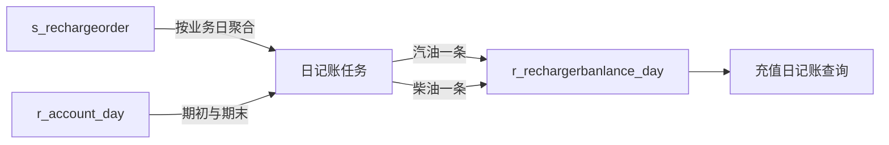

# 充值日记账功能说明

> [!info] 文档定位
> 本文描述充值日记账的业务用途、统计口径、每日调度、补录重算及生产核对结论。底层 SQL、调用链、异常边界和技术改进参见 [[充值日记账技术实现]]。

> [!warning] 当前待处理
> `2026-07-13` 日记账仍是历史订单订正前口径，与当前 `s_rechargeorder` 的充值/退款分类不一致，尚未重算。当前任务不幂等，不能对已有日期直接重复调用。

## 一、功能定位

充值日记账按公司和业务日汇总汽油、柴油账户的充值、余额消费、退款笔数与金额，并关联账户日余额形成期初、期末和账面累计值。



相关表：

| 表 | 职责 |
| --- | --- |
| `s_rechargeorder` | 充值、余额消费、退款权威流水 |
| `r_account_day` | 汽油、柴油账户日余额 |
| `r_rechargerbanlance_day` | 充值日记账结果，每公司日、油品一条 |

`ComRptListBLL.ComczDayList()` 只读取结果表，不负责生成日记账。

## 二、统计口径

任务只读取目标公司、目标业务日、`isstate='0'` 的有效流水。

| `activityrtype` / `oiltype` | 账户 |
| --- | --- |
| `1` | 汽油 |
| `2` | 柴油 |

| `ordertype` | 分类 | 账户方向 |
| --- | --- | --- |
| `0` | 充值 | 增加 |
| `1` | 余额消费 | 减少 |
| `3` | 退款 | 减少 |

金额直接汇总 `sumamount`，不会自动取绝对值。历史金额出现负数时，必须结合订单类型和订单生成时的数据口径判断，不能只凭正负号认定异常。

每日汇总字段：

| 字段 | 含义 |
| --- | --- |
| `qysczcount / qydczmoney` | 当日充值笔数 / 金额 |
| `qysxfcount / qydxfmoney` | 当日余额消费笔数 / 金额 |
| `qystfcount / qydtfmoney` | 当日退款笔数 / 金额 |
| `qysbanlace` | 业务日账户余额快照 |
| `qydbanlace` | 次日账户余额快照 |
| `banlance_zhang` | 按历史订单累计计算的账面余额 |

余额关系：

```text
当日计算期末
= 期初余额
+ 当日充值
- 当日余额消费
- 当日退款
```

> [!note] 负数退款的余额效果
> 如果退款金额为负数，公式会“减去负数”，结果等同于增加余额。因此历史负数充值即使显示在退款分类中，也可能保持期末余额正确；不一致的是分类、笔数和展示金额。

## 三、接口与日期规则

### 每日自动任务

```text
POST /job/ComJobrechargerbanlance
```

接口使用服务器当前日期作为运行日，实际处理前一天：

| 执行时间 | 生成的业务日期 |
| --- | --- |
| `2026-08-08 02:00` | `2026-08-07` |
| `2026-08-09 02:00` | `2026-08-08` |

每日任务不需要 `sendid`。

### 指定日期补录

```text
POST /job/ComJobrechargerbanlance2
```

日期规则：

```text
实际生成日期 = sendid - 1 天
```

例如：

| `sendid` | 实际生成 `billdate` |
| --- | --- |
| `2026-07-14` | `2026-07-13` |
| `2026-07-15` | `2026-07-14` |

带 `2` 的接口只用于人工补录或受控重算，不应配置为每日定时任务。

## 四、请求体与鉴权

两个接口都从 JSON 请求体接收 `JobBaseInfo`：

| 字段 | 说明 |
| --- | --- |
| `companyid` | 必填，公司 ID |
| `timestamp` | Job 鉴权时间戳，由任务中心或调用方提供 |
| `token` | 与时间戳匹配的 Job 签名 |
| `sendid` | 仅补录接口需要 |

原任务中心注册代码只配置：

```json
{"companyid":"f0534be4-e254-4d70-abeb-96377ef54b51"}
```

原任务中心会补充鉴权字段。通用任务平台如果不会自动签名，必须在请求体中同时提供 `timestamp/token`。

请求头只需：

```json
{"Content-Type":"application/json"}
```

`token` 放入请求头无效，当前接口不读取请求头鉴权。请求体也不能留空。

## 五、每日任务配置

顺通石化生产公司：

```text
companyid=f0534be4-e254-4d70-abeb-96377ef54b51
```

任务中心建议配置：

| 表单项 | 填写内容 |
| --- | --- |
| 任务组名 | `每天账户日结:顺通石化` |
| 任务名称 | `每天充值日记账:f0534be4-e254-4d70-abeb-96377ef54b51` |
| 请求地址 | `http://127.0.0.1:62340/job/ComJobrechargerbanlance` |
| 结束时间 | 留空 |
| 触发器类型 | `Cron` |
| Cron | `0 0 2 * * ? *` |
| 请求类型 | `Post` |
| 请求头 | `{"Content-Type":"application/json"}` |
| 请求参数 | `{"companyid":"f0534be4-e254-4d70-abeb-96377ef54b51"}` |
| 邮件通知 | 建议“通知异常” |

正式环境只替换协议、域名和端口，接口路径保持：

```text
/job/ComJobrechargerbanlance
```

> [!warning] 调度注意
> 如果调度服务和后端不在同一台机器，`127.0.0.1` 指向调度服务器自身，必须改成调度服务可访问的后端地址。同一家公司只能有一个有效每日任务，并应避免新任务 misfire 补执行已存在的业务日。

## 六、执行前置与验收

执行前：

1. 业务日和次日的 `r_account_day` 已生成。
2. “每天日结收入”任务已先完成。
3. 目标业务日不存在重复日记账。
4. 同一公司没有另一任务并发执行。

执行后每个公司日必须：

```text
oiltype=1 恰好一条
oiltype=2 恰好一条
```

还要核对：

- 充值、消费、退款笔数；
- 充值、消费、退款金额；
- 期初、期末余额；
- 是否只部分生成汽油或柴油；
- 是否因自动重试产生重复记录。

## 七、补录与重算

### 补录空缺日期

1. 确认目标业务日没有日记账。
2. 确认业务日和次日账户日余额存在。
3. 使用“目标业务日 + 1 天”作为 `sendid`。
4. 调用 `/job/ComJobrechargerbanlance2`。
5. 验证汽油、柴油各一条并核对金额。

补录 `2026-07-14` 示例：

```json
{
  "companyid": "f0534be4-e254-4d70-abeb-96377ef54b51",
  "sendid": "2026-07-15",
  "timestamp": "__TIMESTAMP__",
  "token": "__JOB_TOKEN__"
}
```

### 重算已有日期

> [!danger] 禁止直接重复调用
> 当前接口直接 `INSERT`，不会删除或更新已有记录。对已有业务日重复调用会新增一组汽油、柴油记录。

优先使用专用 SQL，在一个事务内完成备份、删除、重建和校验。如果只能使用现有接口，必须在维护窗口暂停调度，备份旧记录，删除旧记录后立即调用补录接口；失败时从备份恢复。该接口方案存在删除提交至重新插入之间的非原子空窗。

## 八、历史负值充值

历史上后台曾通过退款入口填写负数实现充值：

```text
业务实质：充值
历史显示：ordertype=3，退款
历史金额：负数
余额效果：减去负数，余额增加
```

历史订正后当前订单改为 `ordertype=0`、金额取绝对值，并显示“后台充值/充值”。生产备份与当前表全量核对：

- 备份实际命中 771 笔历史负值充值；
- 771 笔在当前表中全部按相同 `orderid` 找到；
- 771 笔全部正确改为正数充值，五个金额字段与备份绝对值一致；
- 2,948 笔非负退款全部保持退款类型和原金额；
- 当前表没有继续保留负数金额订单。

历史文档中的 724 笔是 2026-07-31 采集快照，生产备份形成时实际增加到 771 笔。

## 九、生产核对结论

### 2026-07-12

当前订单、备份订单和日记账完全一致：

| 油品 | 充值笔数 | 充值金额 | 消费笔数 | 消费金额 | 退款笔数 | 退款金额 |
| --- | ---: | ---: | ---: | ---: | ---: | ---: |
| 汽油 | 711 | 489,006.00 | 2,708 | 540,328.55 | 9 | 1,863.05 |
| 柴油 | 0 | 0.00 | 10 | 14,043.17 | 0 | 0.00 |

### 2026-07-13

日记账仍是订正前口径：

| 油品 | 充值笔数 | 充值金额 | 消费笔数 | 消费金额 | 退款笔数 | 退款金额 |
| --- | ---: | ---: | ---: | ---: | ---: | ---: |
| 汽油 | 637 | 439,005.00 | 2,183 | 465,181.05 | 10 | -3,640.09 |
| 柴油 | 0 | 0.00 | 12 | 6,195.50 | 1 | -15,000.00 |

当前订单正确口径：

| 油品 | 充值笔数 | 充值金额 | 消费笔数 | 消费金额 | 退款笔数 | 退款金额 |
| --- | ---: | ---: | ---: | ---: | ---: | ---: |
| 汽油 | 640 | 444,076.85 | 2,183 | 465,181.05 | 7 | 1,431.76 |
| 柴油 | 1 | 15,000.00 | 12 | 6,195.50 | 0 | 0.00 |

四笔差异：汽油 `56.10`、`15.75`、`5,000.00`，柴油 `15,000.00`，均由历史负数退款显示改为当前正数充值。

余额未变化：

| 油品 | 期初 | 期末 |
| --- | ---: | ---: |
| 汽油 | 35,348,751.08 | 35,326,215.12 |
| 柴油 | 143,853.91 | 152,658.41 |

处理结论：如果日记账必须与当前订单分类一致，应安全重算 `2026-07-13`，补录参数使用 `sendid=2026-07-14`。截至 2026-08-07 尚未执行重算。

### 2026-07-14 至 2026-08-06

升级后每日任务注册遗漏，功能恢复后完成补录：

```text
24 个业务日
48 条记录
每天汽油、柴油各一条
无缺失、重复和异常
```

补录发生在历史负值充值订正后，因此 7 月 14 日以后使用订正后口径，7 月 13 日仍是旧口径，形成数据口径分界。

近期还确认 `2026-07-01、07-02、07-03、07-04、07-05、07-06、07-07、07-11、07-13` 包含类似历史负值充值。若要求全部历史日记账与当前订单一致，应先生成全量差异清单，再统一确定重算范围。

## 十、功能边界

1. 当前只统计汽油和柴油，不统计非油品。
2. 结果是生成时快照，后续订单调整不会联动更新。
3. 当前接口不是幂等重算，重复执行会重复插入。
4. 汽油、柴油插入和累计更新不是单一事务，可能部分成功。
5. HTTP 请求成功不等于业务完整成功，还要检查业务码和数据库结果。
6. 历史负数金额不能脱离订单类型和生成时点单独判断。

## 十一、相关文档

- 技术实现、调用链、SQL 和技术债：[[充值日记账技术实现]]
- 综合会员财务日汇总：[[会员充值消费平衡表功能说明]]

## 十二、版本记录

- 2026-08-07：首次同步，整理当前功能、接口、Cron、历史补录、负值充值口径及 7 月 13 日生产核对结论。
