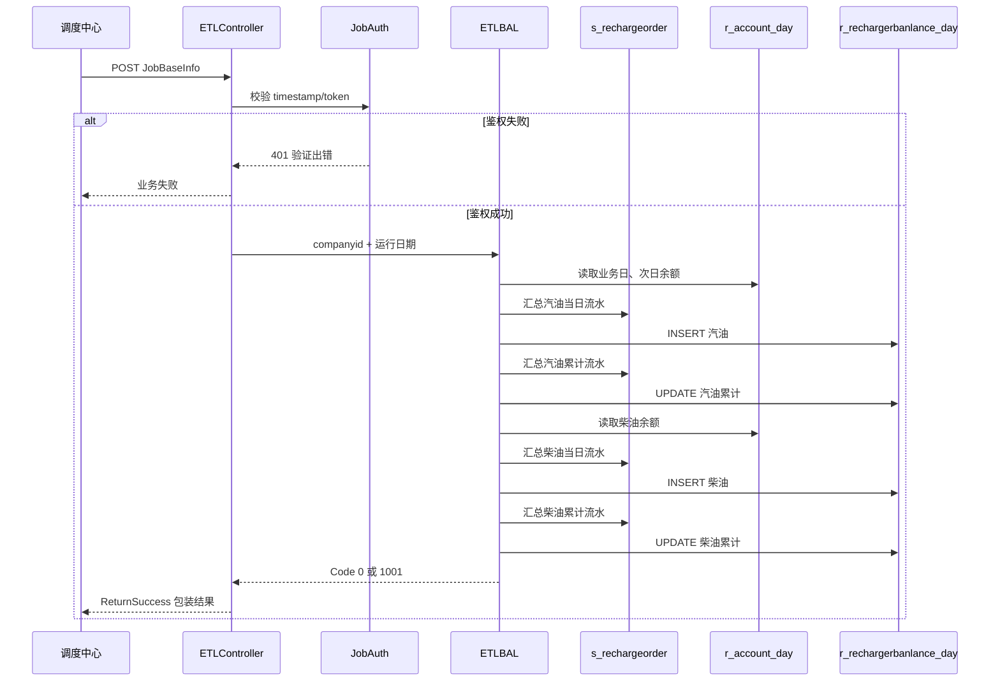
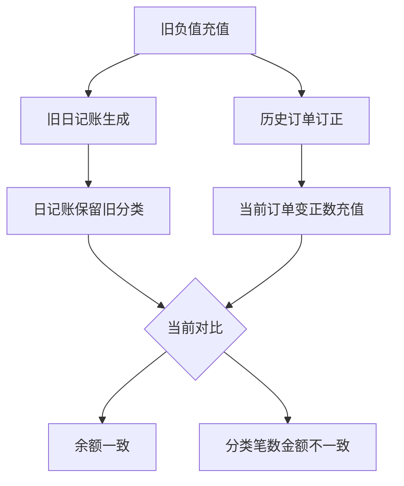
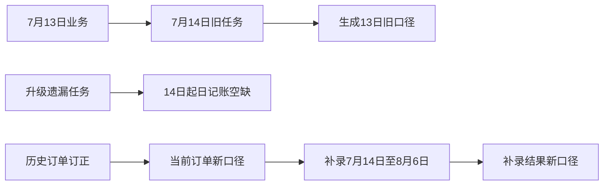
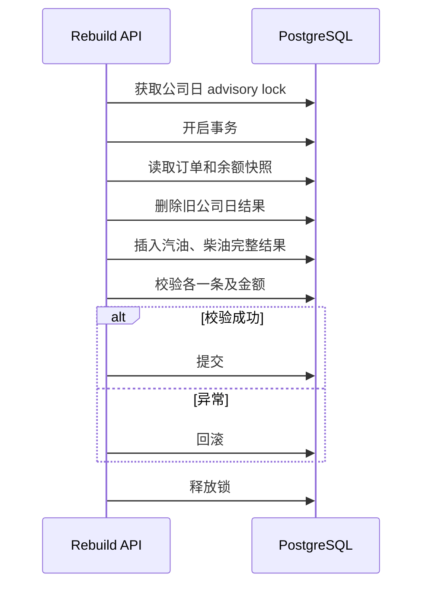

# 充值日记账技术实现

> [!info] 文档定位
> 本文面向开发和运维，记录充值日记账当前代码的调用链、日期计算、SQL 聚合、鉴权、调度、失败模式、数据核验及建议改造。业务口径和生产结果参见 [[充值日记账功能说明]]。

> [!important] 实现基线
> 内容以 2026-08-07 工作区代码和生产只读核对为准。当前实现可继续用于每日生成和空缺日期补录，但不具备幂等、唯一约束、任务锁和原子重算能力。

## 一、实现文件

| 职责 | 文件 / 方法 |
| --- | --- |
| 每日任务入口 | `Controllers/ETL/ETLController.cs`：`ComJobr_rechargerbanlance_day` |
| 指定日期入口 | `Controllers/ETL/ETLController.cs`：`ComJobr_rechargerbanlance_day2` |
| 日记账生成 | `BLL/ETL/ETLBAL .cs`：`ComJobr_rechargerbanlance_day` |
| 每日任务注册 | `BLL/Com/ComcompanyconfigBLL.cs` |
| Job 鉴权 | `Controllers/Pub/BaseController.cs`：`JobOnAuthorization` |
| Job 请求模型 | `Models/job/JobBaseInfo.cs` |
| 调度客户端 | `Lib/jobClass.cs` |
| 结果读取 | `ComRptListBLL.ComczDayList()` |
| 订单模型 | `s_rechargeorder` |
| 余额日表 | `r_account_day` |
| 日记账表 | `r_rechargerbanlance_day` |

历史代码恢复涉及：

- `BLL/ETL/ETLBAL .cs`
- `Controllers/ETL/ETLController.cs`
- `BLL/Com/ComcompanyconfigBLL.cs`

目录调整时遗漏了两个接口、ETL 方法及公司配置中的每日任务注册，当前已按历史实现恢复。

## 二、调用链



## 三、Controller 行为

### 3.1 每日入口

```text
POST /job/ComJobrechargerbanlance
```

核心行为：

```csharp
BLL.ComJobr_rechargerbanlance_day(input.companyid, DateTime.Now)
```

特点：

- 运行日期完全使用后端服务器 `DateTime.Now`。
- 请求体中的 `sendid` 即使存在也不会使用。
- Controller 在鉴权前输出 `input.companyid/timestamp/token`，空请求体可能先触发空引用异常。

### 3.2 指定日期入口

```text
POST /job/ComJobrechargerbanlance2
```

核心行为：

```csharp
BLL.ComJobr_rechargerbanlance_day(
    input.companyid,
    DateTime.Parse(input.sendid))
```

特点：

- `sendid` 必须能由 `DateTime.Parse` 解析。
- Controller 没有显式校验空值、格式或未来日期。
- `sendid` 是运行日期，不是最终 `billdate`。

## 四、日期算法

BLL 统一执行：

```csharp
string rq = dateTime.ToString("yyyy-MM-dd");
string rq2 = dateTime.AddDays(-1).ToString("yyyy-MM-dd");
```

| 变量 | 含义 |
| --- | --- |
| `rq` | 运行日，用于读取业务日结束后的账户余额 |
| `rq2` | 业务日，用于订单聚合和结果 `billdate` |

```text
billdate = 运行日期 - 1 天
```

这导致补录接口容易误传日期。技术改造时应改为显式 `billdate`，由 Controller 验证只能是昨天及以前，避免双重语义。

## 五、Job 鉴权

Controller 使用 `BaseController.JobOnAuthorization(input)`：

```text
expectedToken = MD5("bjos" + timestamp + 固定后缀)
expectedToken == input.token
```

当前行为：

- `timestamp` 和 `token` 都来自请求体。
- 不读取请求头 token。
- 不校验时间戳有效期、重放窗口或 nonce。
- 原任务中心注册只传 `companyid`，依赖任务中心执行器补充鉴权字段。

> [!warning] 安全边界
> 当前签名没有时效性检查，技术上存在固定签名重放风险。文档不记录真实签名值，生产任务应继续由受控任务中心动态生成，并限制接口网络访问范围。

## 六、调度注册

公司配置保存时注册：

```text
Cron = 0 0 2 * * ? *
RequestUrl = /job/ComJobrechargerbanlance
RequestType = Post
RequestParameters = {companyid:"<公司ID>"}
```

`jobClass.AddManJob` 会在相对路径前拼接 `Manurl`，再向本机任务中心：

```text
http://127.0.0.1:52726/api/Job/AddJob
```

提交 `ScheduleEntity`。

任务依赖：


`qysbanlace/qydbanlace` 需要 `r_account_day` 同时存在 `rq2` 和 `rq` 两天数据。账户日结任务必须早于充值日记账完成，不能只保证两个 Cron 都已注册。

## 七、当日聚合 SQL 语义

汽油和柴油分别执行相同逻辑，只切换 `activityrtype` 和余额字段。

过滤条件：

```sql
where companyid = :companyid
  and activityrtype = :oiltype
  and isstate = '0'
  and billdate = :rq2
```

分类聚合：

```sql
count(case when ordertype='0' then sumamount end) as recharge_count,
count(case when ordertype='1' then sumamount end) as consume_count,
count(case when ordertype='3' then sumamount end) as refund_count,
sum(case when ordertype='0' then sumamount else 0 end) as recharge_amount,
sum(case when ordertype='1' then sumamount else 0 end) as consume_amount,
sum(case when ordertype='3' then sumamount else 0 end) as refund_amount
```

技术注意：

1. `count(case ... then sumamount end)` 只统计 `sumamount` 非空的记录；不是严格 `count(*) filter`。
2. 金额没有 `abs()`，按源表符号原样汇总。
3. 代码 SQL 使用字符串拼接，不是参数化查询。
4. `isstate` 数据库类型带尾随空格时依赖 PostgreSQL `char` 比较行为，没有显式 `trim()`。
5. `billdate='yyyy-MM-dd'` 依赖源字段按日期零点保存；没有使用半开区间。

## 八、余额与累计 SQL

### 8.1 期初期末

汽油：

```text
qysbanlace = r_account_day[rq2].banlance
qydbanlace = r_account_day[rq].banlance
```

柴油：

```text
qysbanlace = r_account_day[rq2].cybanlance
qydbanlace = r_account_day[rq].cybanlance
```

子查询找不到记录时返回 `null`；当前代码不会因此中止插入。

### 8.2 累计字段

插入后按 `billdate <= rq2` 再聚合全部历史流水，更新：

- `qysczmoney`：累计充值；
- `qysxfmoney`：累计余额消费；
- `qystfmoney`：累计退款；
- `banlance_zhang`：累计账面余额。

账面余额 SQL 实际为：

```sql
sum(
  case
    when ordertype='0' then sumamount
    else 0 - sumamount
  end
)
```

即除 `ordertype='0'` 外的所有订单类型都作为减项，不只显式限制 `1/3`。如果将来新增其他 `ordertype`，会自动被当作扣减，属于潜在口径风险。

## 九、写入模型与原子性

单次执行生成两个随机 GUID：

```text
keyuuid   -> 汽油 banlanceid
cykeyuuid -> 柴油 banlanceid
```

依次执行四条独立命令：

1. INSERT 汽油日记账；
2. UPDATE 汽油累计字段；
3. INSERT 柴油日记账；
4. UPDATE 柴油累计字段。

当前没有显式事务，因此可能出现：

| 失败点 | 遗留结果 |
| --- | --- |
| 汽油 INSERT 失败 | 无新增 |
| 汽油累计 UPDATE 失败 | 汽油行存在但累计字段未完成 |
| 柴油 INSERT 失败 | 汽油完整，柴油缺失 |
| 柴油累计 UPDATE 失败 | 汽油完整，柴油行部分完成 |

Catch 只返回 `1001 + ex.Message`，不会自动删除已插入的部分结果。

## 十、幂等与并发风险

当前没有：

- 查询已有结果；
- 删除旧结果；
- `ON CONFLICT`；
- `companyid + billdate + oiltype` 唯一约束；
- 数据库任务锁；
- 任务运行记录；
- 同公司、同日并发保护。

因此以下情况都会重复插入：

- 调度中心重复注册；
- 任务 misfire 后补执行；
- 自动重试；
- 操作员重复点击；
- 每日接口与补录接口同时处理同一业务日。

> [!danger] 生产约束
> 在完成幂等改造前，任何重试都必须先查询 `r_rechargerbanlance_day`。已有日期不能直接再次调用接口。

## 十一、响应与监控

| 场景 | 当前行为 |
| --- | --- |
| Job 签名错误 | 返回业务错误 `401`，“验证出错” |
| BLL 成功 | 内层业务码 `0` |
| BLL 异常 | 内层业务码 `1001` 和异常消息 |
| Controller | 使用 `ReturnSuccess` 再包装 BLL 返回值 |

任务中心不能只根据 HTTP 200 判断成功。最低监控应包括：

1. 响应中内层业务码；
2. 当天汽油、柴油记录是否各一条；
3. 是否有重复行；
4. 期初、期末是否为空；
5. 当日订单聚合是否匹配；
6. 汽柴油是否部分成功。

## 十二、只读核验 SQL

### 12.1 重复检查

```sql
select
    companyid,
    billdate::date as billdate,
    oiltype,
    count(*) as row_count
from r_rechargerbanlance_day
where companyid = '__COMPANY_ID__'
group by companyid, billdate::date, oiltype
having count(*) <> 1
order by billdate, oiltype;
```

### 12.2 当前订单单日预期

```sql
select
    activityrtype as oiltype,
    count(*) filter (where ordertype='0') as recharge_count,
    coalesce(sum(sumamount) filter (where ordertype='0'),0) as recharge_amount,
    count(*) filter (where ordertype='1') as consume_count,
    coalesce(sum(sumamount) filter (where ordertype='1'),0) as consume_amount,
    count(*) filter (where ordertype='3') as refund_count,
    coalesce(sum(sumamount) filter (where ordertype='3'),0) as refund_amount
from s_rechargeorder
where companyid='__COMPANY_ID__'
  and billdate::date=date '__BILLDATE__'
  and trim(isstate)='0'
  and activityrtype in ('1','2')
group by activityrtype
order by activityrtype;
```

### 12.3 日记账结果

```sql
select
    billdate::date as billdate,
    oiltype,
    qysczcount,
    qydczmoney,
    qysxfcount,
    qydxfmoney,
    qystfcount,
    qydtfmoney,
    qysbanlace,
    qydbanlace,
    banlance_zhang
from r_rechargerbanlance_day
where companyid='__COMPANY_ID__'
  and billdate::date=date '__BILLDATE__'
order by oiltype;
```

### 12.4 源表与结果差异

建议将 12.2 聚合封装为 CTE，再按 `billdate + oiltype` 连接结果表，逐项比较六个当日指标。不能只比较余额，也不能只判断金额是否为负数。

## 十三、历史负值订正对日记账的影响

历史负值订单业务上是充值，但旧表中保存为 `ordertype='3'` 且金额为负。订正脚本将订单改成正数充值，却没有重算已经存在的 `r_rechargerbanlance_day`。



2026-07-13 四笔差异：

| 油品 | 旧记录 | 当前记录 |
| --- | ---: | ---: |
| 汽油 | 退款 `-56.10` | 充值 `56.10` |
| 汽油 | 退款 `-15.75` | 充值 `15.75` |
| 汽油 | 退款 `-5,000.00` | 充值 `5,000.00` |
| 柴油 | 退款 `-15,000.00` | 充值 `15,000.00` |

旧口径和新口径余额相同，但日记账分类不同。详情及正确汇总见 [[充值日记账功能说明#2026-07-13]]。

## 十四、升级与补录时间线



关键判断：

- 7 月 14 日任务确实处理 7 月 13 日订单。
- 13 日日记账准确反映任务执行时的旧订单状态，不是日结算法在升级当天随机算错。
- 升级实际影响是任务注册遗漏，导致业务日 7 月 14 日起不再自动生成。
- 后续订单订正只改订单，不更新 13 日日记账。
- 7 月 14 日至 8 月 6 日在订正后补录，所以形成 13 日旧口径、14 日以后新口径的分界。

## 十五、安全重算设计

### 当前可用但非原子流程

1. 只读计算目标日预期。
2. 备份目标公司日两条结果。
3. 暂停该公司每日调度。
4. 删除旧汽油、柴油记录并提交。
5. 用 `sendid=业务日+1天` 调用补录接口。
6. 验证两条完整结果。
7. 失败时恢复备份。
8. 恢复调度。

该方案存在删除提交到重新插入之间的空窗。

### 推荐原子方案

新增专用重建服务：



建议契约：

```text
POST /job/ComJobRechargeBalanceDay
billdate = 明确业务日期
```

要求：

- 只允许昨天及以前；
- `companyid + billdate` 任务锁；
- 可重复读快照；
- 删除和插入同一事务；
- 汽柴油一起提交；
- 数据库唯一约束；
- 成功、失败任务记录；
- 错误返回不暴露完整数据库异常。

## 十六、建议数据库约束

在清理现有重复数据后，为结果表增加唯一索引：

```sql
create unique index ux_recharge_balance_day_company_date_oil
on r_rechargerbanlance_day(companyid, billdate, oiltype);
```

执行前必须确认：

```sql
select companyid,billdate,oiltype,count(*)
from r_rechargerbanlance_day
group by companyid,billdate,oiltype
having count(*)>1;
```

如果 `billdate` 可能包含非零时分秒，应先统一日期约束或使用日期表达式索引，不能直接假设所有历史值都是零点。

## 十七、技术债优先级

| 优先级 | 改进 | 原因 |
| --- | --- | --- |
| P0 | 唯一约束 + 幂等重建 | 防止重复财务日记账 |
| P0 | 汽柴油同事务 | 防止部分成功 |
| P0 | 明确业务日期参数 | 消除 `sendid-1` 误操作 |
| P1 | advisory lock | 防止并发任务 |
| P1 | 任务状态表与监控 | 区分 HTTP 成功和业务完整成功 |
| P1 | 参数化 SQL | 降低拼接风险并改善可维护性 |
| P1 | 账户日余额前置校验 | 防止余额字段为空仍写入 |
| P2 | timestamp 时效校验 | 降低 Job 签名重放风险 |
| P2 | 半开日期区间 | 兼容带时间的历史 `billdate` |
| P2 | 显式限制累计订单类型 | 避免未来类型被默认作为扣减 |

## 十八、验收矩阵

### 接口

- [ ] 每日接口只处理 T-1。
- [ ] 指定日期接口明确处理 `sendid-1`。
- [ ] 空请求、缺公司、缺签名和错误日期返回明确错误。
- [ ] HTTP 和业务结果都被监控。

### 数据

- [ ] 每公司日汽油、柴油各一条。
- [ ] 六个当日指标与源订单聚合一致。
- [ ] 两个余额快照存在且日期正确。
- [ ] 累计字段与 `billdate<=业务日` 口径一致。
- [ ] 历史负值不只按符号判错。

### 幂等与失败

- [ ] 同一公司日重复执行不增加行数。
- [ ] 并发执行只有一个成功取得锁。
- [ ] 柴油失败时汽油不单独提交。
- [ ] 重建失败保留上一版完整结果。
- [ ] 自动重试、misfire 和人工重试均不会重复。

## 十九、相关笔记

- 业务口径、调度填写和生产核对：[[充值日记账功能说明]]
- 综合会员财务报表：[[会员充值消费平衡表功能说明]]

## 二十、版本记录

- 2026-08-07：根据当前 Controller、ETL BLL、调度注册、Job 鉴权及生产只读核对生成首版技术实现文档；记录非幂等、非事务、日期偏移和历史订正口径分界。
