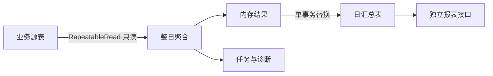

# 咕咚会员充值消费平衡表方案

> [!important] 最终结论
> 本报表采用旁路日汇总，不修改充值、加油、支付、退款、优惠计算和账户更新流程。任务只读业务源表，只写报表结果表及任务表；失败保留上一版完整结果，按整日原子重算，不再使用 `last_success_id` 续跑。

## 一、建设目标

- 默认查询 T-1，按公司每日汇总充值、退款、余额消费、加油和优惠。
- 查询客户真实加油原价、优惠前结算、实际支付和优惠金额。
- 汽油、柴油、非油品账户分别展示期初、期间流水、计算期末、实际期末和平衡差额。
- 支持公司 → 会员类别 → 站点 → 客户订单钻取。
- 站点层只展示流水，不计算余额。

## 二、真实业务口径

### 充值权益

- `s_rechargemedium` 是充值活动的会员来源/推广渠道限制，不是实物赠品，不产生金额。
- 现金实送使用订单落库时的 `s_rechargeorder.dnamount`，不按当前活动配置回算历史。
- 水等实物通过实际发放的优惠券表达，按 `s_couponuser.moduleid = s_rechargeorder.orderid` 关联，展示券数量和券面值。
- `s_rechargeactivityoillist.price/yprice` 是每升优惠额，不是油品销售单价，不能在充值日估算未来总优惠。
- 充值活动油惠在消费时实际发生，使用 `r_consorderlist.rechargmoney` 展示。

### 加油金额

| 指标 | 来源 | 含义 |
| --- | --- | --- |
| 加油原价 | `s_consorder.ysumamount` | 油价和数量形成的原始金额 |
| 优惠前结算 | `s_consorder.sumamount` | 优惠分摊前的结算金额 |
| 客户实际支付 | `s_consorder.payamount` | 客户最终承担金额 |
| 优惠总额 | `s_consorder.dnamount` | 客户实际享受优惠 |
| 价格差异 | `ysumamount - sumamount` | 价格或取整差异，不是优惠或余额扣减 |

成功消费满足：

```text
sumamount = payamount + dnamount
```

优惠组成：

```text
rechargmoney + usermoney + memberamount + netcaramount
+ activityamount + couponamount + accpointsamount
```

```text
优惠拆分差额 = dnamount - 优惠组成
```

订单明细以 `s_consorder` 为主表，左连接 `r_consorderlist`。宽表缺失时仍返回订单主金额，优惠组成显示缺失，不能把缺失值伪装为完整的 0 元拆分。

### 权威余额流水

余额增减统一来自 `s_rechargeorder`：

| ordertype | 业务 | 账户方向 | 金额 |
| --- | --- | --- | --- |
| `0` | 普通充值 | 增加 | `reamount + dnamount` |
| `1` | 余额消费 | 减少 | `sumamount` |
| `3` | 退款 | 减少 | `sumamount`；成功退款在数据库中以正数保存 |

微信等外部支付没有 `ordertype='1'` 流水，不影响会员余额。余额支付订单与流水通过 `s_rechargeorder.fromorderid = s_consorder.orderid` 核对；少量历史缺失或孤立流水只告警，不自动修复。

账户对应关系：

| activityrtype | 账户 | 当前余额字段 |
| --- | --- | --- |
| `1` | 汽油 | `s_account.banlance` |
| `2` | 柴油 | `s_account.cybanlance` |
| `8` | 非油品 | `s_account.tybanlance` |

## 三、余额公式

```text
计算期末
= 期初余额
+ 普通充值本金
+ 现金实送
- 退款本金及赠送冲减
- 余额消费实际扣款

平衡差额 = 计算期末 - 实际期末余额
```

经营指标独立展示，不混入余额公式。公司层是权威勾稽；会员层按当前会员等级归类，仅用于定位；由于 `s_account.stationid` 没有有效数据，站点层不展示余额。

## 四、任务架构



- 使用 PostgreSQL `RepeatableRead` 快照和报表专用 advisory lock。
- 同一公司、同一业务日只允许一个任务执行。
- 成功时在同一事务中删除旧日结果、插入新结果并更新任务成功状态。
- 失败时事务回滚，旧结果不变；任务记录步骤和错误。
- 诊断包括余额消费缺流水、孤立余额流水、消费宽表缺失、未识别会员、未归属站点、未知账户类型。
- 实际单公司单日数据量可整日重算，不使用无序 GUID 作为续跑游标。

## 五、汇总维度

`r_member_finance_day` 同时保存四类 `accounttype`：

- `0`：经营指标。
- `1`：汽油账户。
- `2`：柴油账户。
- `8`：非油品账户。

层级：

| rptlevel | 维度 | 余额勾稽 |
| --- | --- | --- |
| `0` | 公司 + 业务日 + 账户类型 | 三类账户有 |
| `1` | 公司 + 业务日 + 账户类型 + 会员类别 | 三类账户有，参考口径 |
| `2` | 公司 + 业务日 + 账户类型 + 会员类别 + 站点 | 无 |

唯一维度包含 `companyid, billdate, rptlevel, accounttype, memberlevel, stationid`。

## 六、接口与页面

接口：

- `POST /com/rpt/ComMemberFinanceDayOverview`：公司经营指标和三账户勾稽。
- `POST /com/rpt/ComMemberFinanceDayTree`：会员类别/站点树。
- `POST /com/rpt/ComMemberFinanceDayMember`：会员类别下各站汇总。
- `POST /com/rpt/ComMemberFinanceDayStation`：指定站点汇总。
- `POST /com/rpt/ComMemberFinanceDayRecharge`：充值、退款、余额扣款明细。
- `POST /com/rpt/ComMemberFinanceDayCons`：加油订单和优惠明细。
- `POST /com/rpt/ComMemberFinanceDayTask`：单日任务状态和诊断。
- `POST /com/rpt/ComMemberFinanceDayRebuild`：当前公司的单日手动重算。
- `POST /job/ComJobMemberFinanceDay`：签名定时任务入口。

页面默认 T-1，提供“经营指标、汽油账户、柴油账户、非油品账户”四个视图。加油明细明确展示“客户实际支付”和“优惠总额”；缺宽表订单标记“宽表缺失”。手动重算只允许昨天及以前的单日，执行前二次确认。

## 七、数据库与验证

脚本：

- `database/r_member_finance_day.sql`
- `database/r_member_finance_day_menu.sql`
- `database/r_member_finance_day_verify.sql`

源表索引使用 `CREATE INDEX CONCURRENTLY`，在事务外执行。核验脚本只读检查：

1. 三账户余额公式。
2. 每日四类公司汇总行。
3. `sumamount = payamount + dnamount`。
4. 余额支付与权威流水匹配。
5. 消费宽表缺失。
6. 经营汇总与源表合计。
7. 公司行与会员行合计。

> [!warning] 部署限制
> 当前代码和脚本尚未对生产执行任何 DDL 或写入。先部署报表表结构和代码，再按日期从早到晚回填；抽样验收通过后才配置每日凌晨任务。

## 八、关联文档

- 项目当前迭代：`docs/10-当前迭代/会员充值消费余额日汇总方案.md`
- 动态菜单：`database/r_member_finance_day_menu.sql`
- 只读核验：`database/r_member_finance_day_verify.sql`
