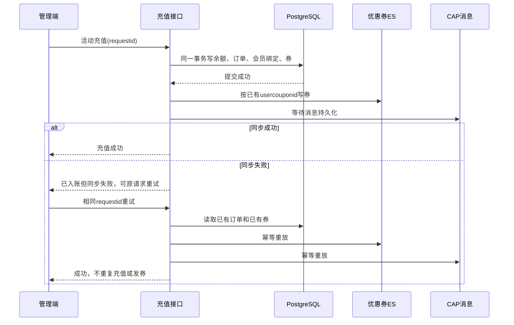

# 手动活动充值兼容方案

## 目标与边界

- 仅修改 `maninterface` 后端与静态管理端，不修改或发布 `foreinterface`。
- 在“账号退款”的充值模式中增加汽油电子卡活动充值，柴油、自定义充值和退款保持原行为。
- 下拉活动名称直接来源于“充值管理 -> 活动管理”的 `s_rechargeactivity`，不读取“团购秒杀 -> 团购管理”的 `s_groupactivities`，也不做跨表名称匹配。
- 管理端不复制手机端加油优惠算法，只写入手机端可识别的活动绑定和充值权益数据。
- 不创建微信待支付订单，不发送支付成功通知，不处理充值券抵扣和分销佣金。

## 已批准的赠券同步修复实施方案

> [!success] 审批状态
> 该实施方案于 2026-08-03 获得批准，范围为修复后台活动充值赠券同步，并补齐已确认缺失的 3 张历史券；当前已实施并验证完成。

### 目标

修复后台活动充值“数据库已生成券、ES/CAP 未同步且失败无感知”的问题，并在不新增充值、不重复写券的前提下，补齐已确认缺失的 3 张历史券。

### 实施步骤

1. **固化数据库为券同步事实源**
   - 从已持久化的 `s_couponuser` 显式映射 ES 模型。
   - 同步保留原 `usercouponid`、`moduleid=orderid` 和 `acctype='14'`，保证重放只覆盖同 ID 文档。
   - 校验映射数量、主键和订单关联，禁止空映射被当作成功。
2. **让同步失败可被检测**
   - 检查 `MyEsClient.Adds` 返回值，返回 `false` 时按失败处理。
   - 等待 CAP `PublishAsync` 完成，使消息持久化异常进入失败处理。
   - 资金事务已经提交时，返回“充值已成功、可使用原请求重试”的明确提示，不误报为充值回滚。
3. **使相同 `requestid` 具备补偿能力**
   - 命中已有订单时，按 `moduleid=orderid` 加载数据库已有赠券并重放 ES/CAP。
   - 补偿分支不再执行余额更新、订单新增、会员活动覆盖、积分成长值或赠券新增。
   - 兼容历史订单的 `activityrid` 和 `fromorderid` 来源字段差异。
4. **补齐 3 张历史券**
   - 使用两笔原订单的 `orderid/requestid` 进入幂等补偿，不直接构造新券。
   - 补偿前后比较订单、账户和数据库券数量，确保资金与权益主数据未增加。
   - 使用数据库已有 `usercouponid` 验证 `comcouponuser-index` 命中 3/3，并核对 CAP 消息状态。
5. **构建、验证与文档维护**
   - 构建后端单项目，执行前后端 `git diff --check` 和前端 JavaScript 语法检查。
   - 验证 1 张券、2 张券、重复 `requestid`、ES 文档幂等、数据库券不重复及同步失败可见性。
   - 将根因、补偿机制和历史修复结果同时维护在项目当前方案文档与 Obsidian“咕咚项目”笔记中。

### 安全边界

- 不执行新的真实充值。
- 历史补偿只读取现有数据库赠券，并按原 `usercouponid` 重放同步。
- 不修改或发布 `foreinterface`，只将其作为手机端兼容性参照。
## 手机端兼容契约

活动充值成功后写入：

- `s_userinfo.isrecharge='1'`
- `s_userinfo.rechargeid=<所选充值活动ID>`
- `s_userinfo.rechargname=<所选充值活动名称>`

手机端继续使用所选充值活动的 `rechargeid` 查询 `s_rechargeactivityoillist`，结合油品、油站、汽油余额和会员配置计算优惠。新活动覆盖当前汽油活动绑定，并作用于当前整个汽油余额。

## 管理端实现

- 充值页面增加“自定义充值/活动充值（仅汽油）”。
- 自定义充值继续调用原有分支，不读取、覆盖或清除活动绑定。
- 活动充值必须先选择油站。候选活动直接读取截图所示“充值管理 -> 活动管理”的活动记录。
- 充值油站沿用管理端油站下拉口径：必须属于当前企业且 `isstate != -1`；不额外要求 `isstate=0`，以兼容手机二维码中作为 `referee` 使用的站点。
- `stationrecharge` 为空的活动按手机端口径视为全油站通用；非空时按逗号拆分并精确比较 `stationId|stationName` 左侧 ID。
- 选择充值活动后只读展示其配置的充值金额、赠送金额和到账总额，后台必须按数据库活动配置金额入账，不接受客户端调整。
- 活动列表返回所选充值活动是否存在油品优惠明细；无明细时只提示“不会产生每升优惠”，不阻止只赠金额或赠券的合法活动绑定。
- 活动列表与提交均校验充值活动的企业、汽油类型、电子卡、启用状态、有效期、会员来源和油站资格；不限制“使用类型”字段，`typeid="0"` 和 `typeid="1"` 的活动均可按充值参与油站绑定。
- 每次提交生成固定 GUID `requestid`，服务端以该值作为订单主键实现幂等。

## 事务与权益

活动充值在独立事务中完成：

1. `FOR UPDATE` 锁定会员账户并检查重复 `requestid`。
2. 按客户端提交的 `activityrid` 重新读取并校验 `s_rechargeactivity`，防止伪造活动 ID 或配置变化。
3. 忽略客户端金额，账户和订单统一使用所选充值活动配置的 `reamount`、`dnamount` 和 `sumamount`。
4. 更新汽油余额、充值累计和充值次数。
5. 创建已完成的后台活动充值订单，`activityrid`、`activitytitle` 和 `fromorderid` 直接记录所选充值活动的 ID/名称。
6. 更新会员汽油活动绑定：`rechargeid` 和 `rechargname` 直接使用所选充值活动的 ID/名称。
7. 按所选充值活动配置写入充值积分、普通/专车成长值、等级和活动赠券。

事务提交后分别同步充值订单 ES、赠券 ES 和 CAP：

- 赠券 ES 直接从已持久化的 `s_couponuser` 显式映射，保留原 `usercouponid`、`moduleid=orderid` 和 `acctype='14'`，不依赖未配置的通用 AutoMapper 映射。
- 必须检查 `MyEsClient.Adds` 返回值；返回 `false` 与抛出异常均记为同步失败。
- CAP 发布等待 `PublishAsync` 完成，确保消息持久化异常可以被检测。
- 事务提交后的同步失败返回代码 `1003`，明确提示“充值已成功”，并要求使用原请求重试，避免操作员误判为回滚后重新充值。
- 相同 `requestid` 命中已有后台活动充值订单时，从数据库按 `moduleid=orderid` 加载已有赠券，只重放订单和赠券的 ES/CAP，不再更新账户、会员、积分、成长值或新增券。
- 补偿重放接受历史订单的 `activityrid` 或 `fromorderid` 任一与请求活动匹配，以兼容旧版曾使用不同字段记录活动来源的订单。

## 发布与验证

发布顺序：

1. 发布 `bjos.maninterface.recon` 后端。
2. 发布 `html` 管理端。
3. 不发布 `foreinterface`。

上线前后验证：

- 非法企业、过期/禁用、来源不匹配、IC 卡、柴油和错误油站活动不可用。
- 下拉显示名称与“充值管理 -> 活动管理”中的 `activitytitle` 一致；成功后 `rechargname` 也使用该名称。
- 全油站通用活动可在任意未删除油站选择；指定油站活动只能在配置油站选择。
- 篡改客户端充值金额或赠送金额后，订单、账户累计、余额、积分和成长值仍使用数据库活动配置金额。
- 重复 `requestid`、双击和网络重试只产生一笔充值和一套权益。
- 同步失败后使用相同 `requestid` 重试，可补齐缺失 ES/CAP，且账户余额、累计金额、充值次数、订单数和数据库券数均保持不变。
- 核对 `s_rechargeorder`、`s_account`、`s_userinfo`、积分、成长值、等级和赠券。
- 使用未修改的手机端查询会员加油优惠，确认读取新绑定并返回对应汽油优惠。
- 回归汽油自定义充值、柴油自定义充值、汽油/柴油退款、作废及历史订单查询。
- `foreinterface` 仅用于核对手机端充值和加油优惠读取契约，不产生任何文件修改或发布。

## 当前验证记录

- `node --check html/js/comuserinfo/Amount.js` 通过。
- `dotnet build bjos.maninterface.recon/BJOS.ManInterface/BJOS.ManInterface.csproj --no-restore` 通过，0 个编译错误；解决方案构建仍因缺少 `BJOS.Public.Common/BJOS.Public.Common.csproj` 无法执行。
- 内置浏览器只读检查确认“充值活动充值（仅汽油）”、当前充值活动和油站选择正常显示；活动来源提示已进一步对齐截图为“充值管理-活动管理”。
- 只读查询确认 `测试汽油支付问题` 直接来自 `s_rechargeactivity`，有效期为 2026-07-28 至 2026-08-31，充值参与油站包含“顺通石化第88加油站”；该活动的 `typeid="0"`，因此后台绑定不再限制使用类型。
- 本地后端已重新构建并重启。活动接口实测选择“顺通石化第88加油站”时返回 `测试汽油支付问题`，活动 ID 与活动管理记录一致；未执行真实活动充值入账。
- 十里堡站联动审查确认：`3600元扫码充值（5角）` 的 `stationrecharge` 正确包含“顺通石化十里堡站”，油站匹配成功；但活动于 2026-06-22 到期，因此按已确认规则不进入下拉框。该现象不是动态联动故障。
- 前端通过 `activityLoadSequence` 丢弃快速切换油站时返回的旧请求结果，避免旧油站活动覆盖当前油站下拉框。
- 自定义充值接口拒绝 `activityrtype` 非 `1/2` 的请求，避免创建已完成订单但账户未入账。

## 充值送券核验与修复记录

2026-08-03 对当前企业活动和近期真实后台活动充值执行只读核验：

- 当前有效、启用的汽油电子卡充值活动共 41 个，其中 26 个配置了充值赠券，15 个未配置赠券。
- 26 个已配置活动均未发现券模板缺失、停用或跨企业关联。
- 两笔近期真实后台活动充值在数据库已生成 3 张 `s_couponuser`：
  - `1000元扫码充值（十里堡）` 应发及实发水券 1 张。
  - `2000元扫码充值` 应发及实发水券 2 张。
- 修复前按 `moduleid` 和 3 个数据库 `usercouponid` 分别查询 `comcouponuser-index`，结果均为 0；对应订单 ES 文档存在，问题仅发生在赠券同步。
- 根因有两项：
  - `s_couponuser -> EscomcouponuserModels` 没有 AutoMapper 类型映射，通用 `MapTo` 会抛出 `Missing type map configuration`。
  - 原实现忽略 `MyEsClient.Adds` 的布尔返回值，相同 `requestid` 又直接返回已有订单，导致失败不可见且无法补偿。

修复后使用两笔原订单的 `orderid/requestid` 走幂等重放，未执行新充值：

- 两笔请求均返回成功。
- 两笔订单各仍只有 1 条，数据库赠券仍为 1 张和 2 张，没有新增或重复。
- 账户余额、累计金额、实充/赠送累计和充值次数与补偿前基线完全一致。
- ES 按原 `usercouponid` 查询命中 3/3，且 `moduleid`、`acctype='14'`、券名称均与数据库一致。
- CAP 找到 3 条对应赠券消息，状态全部为 `Succeeded`。
- 最终独立构建产物：`builds/man-kf2/20260803100505/`，后端项目构建 0 个错误；前后端 `git diff --check` 和 `node --check html/js/comuserinfo/Amount.js` 均通过。
